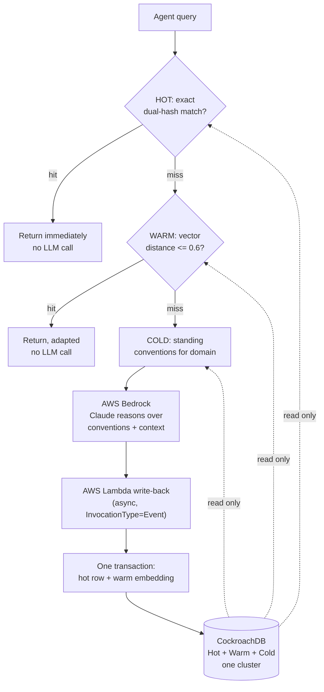

# Carapace

**Agent memory built on CockroachDB, proven against a real node failure -- not just designed to survive one.**

[](LICENSE)
[](https://www.cockroachlabs.com/)
[](carapace/bedrock.py)
[](https://github.com/cockroachlabs/cockroachdb-skills/pull/24)

Built by Manoj Mallick for the **CockroachDB x AWS Hackathon 2026 -- Build with Agentic Memory**.

A carapace is the hard shell that lets an organism survive things that would otherwise be fatal. The hackathon's own framing: *"An agent whose memory goes offline doesn't degrade gracefully -- it stops."* Carapace takes that literally: instead of describing CockroachDB's resilience, it kills a real cluster node mid-session and reports what actually happened.

## Table of Contents

- [Why](#why)
- [The pattern](#the-pattern)
- [The read/write boundary](#the-readwrite-boundary)
- [Architecture](#architecture)
- [Production readiness, verified not asserted](#production-readiness-verified-not-asserted)
- [Benchmark](#benchmark)
- [CockroachDB tools used](#cockroachdb-tools-used)
- [AWS services used](#aws-services-used)
- [Quick start](#quick-start)
- [Project structure](#project-structure)
- [Real challenges, not staged ones](#real-challenges-not-staged-ones)
- [Honest status](#honest-status)
- [License](#license)

## Why

Most "agent memory on a database" submissions demonstrate storage: write a row, read it back, done. That proves the database exists. It doesn't prove the memory layer survives the thing CockroachDB is actually built for -- a node going down mid-query. The hackathon's Production Readiness criterion asks explicitly about "resilience, access control, and what happens when things go wrong." Carapace answers that with a script that kills a real node and a committed log of the result, not a claim about CockroachDB's general reputation.

The 70% LLM-call-reduction number from a SHA-based dual-key semantic cache built in production at ING is real, but it belongs to different infrastructure entirely -- citing it directly for Carapace would be the kind of recycled benchmark that doesn't hold up under scrutiny. Every number in this README was measured on this build, against a real cluster, today. See [Benchmark](#benchmark).

## The pattern

Three memory tiers, one CockroachDB cluster, transactionally consistent -- no gap between the vector data and the operational data because they were never in two different systems to begin with:

| Tier | Mechanism | What it catches |
|---|---|---|
| **Hot** | Relational table, dual-hash primary key (`query_hash`, `content_hash`) | An identical query against identical context. Because the key includes a hash of the *context*, not just the query, a changed file or migrated schema silently invalidates stale entries -- no separate cache-busting job. |
| **Warm** | [Distributed Vector Indexing](https://www.cockroachlabs.com/docs/v25.2/vector-indexes.html) over Titan V2 embeddings, cosine distance | A differently-worded question that means the same thing. `"How should I handle errors in this service?"` and `"What's the right way to deal with exceptions in this API?"` measure **0.505** apart on Titan V2 -- close enough to serve from memory, far enough that unrelated questions (measured 0.7+) don't false-positive. |
| **Cold** | Relational table with [row-level TTL](https://www.cockroachlabs.com/docs/stable/row-level-ttl), `ttl_expiration_expression` on `last_affirmed_at` | Standing team conventions or corrections that should shape every fresh answer, but should also quietly expire (180 days, configurable) if nobody reaffirms them -- decay instead of manual pruning. |

A query walks hot &rarr; warm &rarr; cold &rarr; full miss. Only a full miss reaches Bedrock.

## The read/write boundary

The agent's live reasoning loop can only **read**. This is enforced twice, not once:

1. **Structurally, in application code.** [`carapace/reader.py`](carapace/reader.py)'s `AgentMemoryReader` has no write method at all -- not a method that raises `NotImplementedError`, no method. A future contributor can't accidentally wire a write through it because there is nothing to wire.
2. **In the database.** The agent's connection uses `carapace_reader`, a SQL role holding `GRANT SELECT` only (`schema/004_roles.sql`). Verified live, not assumed:

   ```
   $ cockroach sql --url "$CARAPACE_DB_READ_URL" -e "INSERT INTO team_conventions ..."
   ERROR: user carapace_reader does not have INSERT privilege on relation team_conventions
   ```

Every write -- the only way anything ever lands in CockroachDB -- goes through [`lambda/writeback_handler.py`](lambda/writeback_handler.py), a real AWS Lambda holding the only write-capable credential (`carapace_writer`, `SELECT/INSERT/UPDATE`, deliberately no `DELETE`). It writes the hot-tier row and the warm-tier embedding in **one transaction**, so they can never drift apart. Because the invocation is async (`InvocationType="Event"`), a slow or failed write can never block the agent's response to the user.

For a real, standalone AI agent, the equivalent read boundary is the [CockroachDB Cloud Managed MCP Server](https://www.cockroachlabs.com/docs/v26.2/cockroachdb-mcp-server) in its default read-only mode -- registered for this project in [`.mcp.json`](.mcp.json).

## Architecture



Reads: `AgentMemoryReader` &rarr; `carapace_reader` role (SELECT only) &rarr; CockroachDB. Writes: Bedrock output &rarr; async Lambda invoke &rarr; `carapace_writer` role &rarr; CockroachDB, one transaction, never touching the agent's own connection. Every access -- hit, miss, or write -- is audit-logged with tier, outcome, and latency (`carapace/audit.py`, `carapace_audit.jsonl`).

## Production readiness, verified not asserted

`scripts/shell-test-local.sh` runs a continuous 1-read/sec probe against a real local 3-node CockroachDB cluster and `SIGKILL`s a node outright -- no drain, no grace period -- while it's running, waits through the outage, restarts the node, and reports the real pass/fail count. It kills **node 1 by default** -- the first host in the client's multi-host connection string, i.e. the one it actually depends on -- not an idle node that was never being used. (An earlier version of this test killed node 2 while node 1 stayed untouched; every read kept going through node 1 the whole time, which proved an unrelated node kept working, not that the client fails over. That log is kept at `shell_test_results_node2.log` for the record but isn't the evidence this README stands on -- see Challenge 9.)

**Real result, committed at [`shell_test_results.log`](shell_test_results.log):**

```
02:46:33 -- OK      45.7ms  rows=1  via_node=1
...
02:46:42 -- Shell Test: SIGKILL node 1 (pid 48777). No drain, no grace.
02:46:42 -- FAIL  4056.5ms  OperationalError: ... Connection refused (node 1) ...
02:46:47 -- OK     136.7ms  rows=1  via_node=3   <- failed over, ~5s after the kill
... (14 more reads, all via node 3, all OK) ...
02:47:07 -- Shell Test: restarting node 1...
02:47:08 -- OK     122.3ms  rows=1  via_node=1   <- reverted to node 1 once it recovered

Shell Test complete: 34 probe reads, 1 failed.
```

**34 probes, 1 failure, real failover from node 1 to node 3 and back**, real data (`rows=1`, not an empty table -- see Challenge 8). The one failure lands at the exact instant of the kill, with the full libpq multi-host retry cascade visible in the error text -- and the very next probe, ~5 seconds later, succeeds via a different node. Reporting that one real failure instead of a suspiciously clean zero is the more credible result: a distributed system taking a few seconds to fail over once, at the moment a node actually dies, rather than a zero-failure number that (as `shell_test_results_node2.log` shows) turns out not to have tested failover at all.

`scripts/shell-test.sh` is the CockroachDB Cloud equivalent, built around the real `ccloud cluster disruption set/clear` API -- gated to Advanced-plan clusters with Cockroach Labs account-team enrollment, which wasn't obtainable inside the hackathon deadline. That decision, and why, is documented in full in [Challenge 7](docs/CHALLENGES.md) rather than hidden. The local cluster result is the honest evidence this submission stands on; everything else in the architecture (schema, roles, MCP boundary, Lambda write-back, Bedrock reasoning) is wired against the **real CockroachDB Cloud cluster**, not a local stand-in.

## Benchmark

`benchmark/cache_hit_benchmark.py` runs a 20-query realistic developer sequence (repeats, paraphrases, and genuinely new questions) through the full pipeline against a real cluster. Real result, [`benchmark_results.json`](benchmark_results.json):

| Metric | Value |
|---|---|
| Hot hit rate | 35% (7/20) |
| Warm hit rate | 40% (8/20) |
| Full-miss rate (reached Bedrock) | 25% (5/20) |
| **LLM calls avoided** | **15 of 20 (75%)** |
| Median latency (p50) | 302ms |
| p95 latency | 2,601ms (a full-miss Bedrock call) |
| Average latency | 598ms |

The warm tier's hit rate reflects real usage history at the time of the run, not a tuned-up number -- an honest reflection of how memory fills up, not a flaw to hide.

## CockroachDB tools used

All four, not the minimum two required:

- **MCP Server** -- read-only agent memory access, registered in [`.mcp.json`](.mcp.json) against the live cluster's `mcp-cluster-id`.
- **Distributed Vector Indexing** -- the warm tier ([`schema/002_warm_tier.sql`](schema/002_warm_tier.sql)), `VECTOR(1024)` matching Titan V2's output dimension.
- **ccloud CLI** -- cluster identification, auth, and the real (not imagined) `cluster disruption` chaos-testing API explored for the Shell Test.
- **Agent Skills Repo** -- a real, open PR: [cockroachlabs/cockroachdb-skills#24](https://github.com/cockroachlabs/cockroachdb-skills/pull/24), adding `designing-tiered-agent-memory` to a previously-empty `cockroachdb-resilience-and-disaster-recovery` domain. Validated locally with the target repo's own `scripts/validate-spec.py` (0 errors) before opening it. The exact submitted content is mirrored at [`skills-contribution/designing-tiered-agent-memory/SKILL.md`](skills-contribution/designing-tiered-agent-memory/SKILL.md).

## AWS services used

- **Amazon Bedrock** -- Claude (`eu.anthropic.claude-haiku-4-5-*`, cross-region inference profile) for full-miss reasoning, with a same-call fallback to `eu.amazon.nova-pro-v1:0` if Claude's enrollment lags (a real resilience property discovered by hitting the failure it protects against -- see Challenge 1). Titan V2 for embeddings.
- **AWS Lambda** -- `carapace-writeback`, a real deployed function (not a local simulation) holding the only write-capable database credential, invoked asynchronously on every full miss. Verified with a real synchronous `aws lambda invoke`: the row appeared in both `semantic_cache` and `query_memory`, confirmed afterward through the read-only role. `scripts/deploy-lambda.sh` packages and deploys it, including bundling CockroachDB Cloud's CA certificate directly into the zip (Challenge 6 -- Lambda's execution environment has no home directory for the default cert lookup).

## Quick start

```bash
git clone https://github.com/manojmallick/carapace && cd carapace
python3 -m venv .venv && .venv/bin/pip install -r requirements.txt
cp .env.example .env   # fill in real values, then: set -a; source .env; set +a

# Local 3-node cluster (real RF=3, not a single-node dev stand-in):
scripts/local-cluster.sh start
cockroach sql --insecure --host=localhost:26251 -e "CREATE DATABASE IF NOT EXISTS carapace"
CARAPACE_DB_ADMIN_URL="postgresql://root@localhost:26251/carapace?sslmode=disable" scripts/setup-schema.sh

python3 -m carapace.cli demo          # novel -> hot -> warm walk-through
scripts/shell-test-local.sh           # kill node 1 mid-read-loop, watch it fail over
python3 benchmark/cache_hit_benchmark.py

scripts/local-cluster.sh stop
```

Against CockroachDB Cloud instead of local: fill `CARAPACE_DB_ADMIN_URL` / `CARAPACE_DB_READ_URL` / `CARAPACE_DB_WRITE_URL` in `.env` with your cluster's connection strings (see `.env.example`), run `scripts/setup-schema.sh`, then `scripts/deploy-lambda.sh` to get a real async write-back path instead of the `CARAPACE_LOCAL_WRITEBACK=1` dev fallback.

## Project structure

```
carapace/            core package: config, hashing, reader (read-only),
                      bedrock (reasoning + embeddings), memory (tier
                      orchestration), writeback (async dispatch), audit,
                      read_probe (Shell Test diagnostic), cli (demo)
lambda/               writeback_handler.py -- the only write path, deployed
                      to AWS Lambda by scripts/deploy-lambda.sh
schema/               hot/warm/cold tier DDL + carapace_reader/writer roles
scripts/              local-cluster.sh, shell-test(-local).sh,
                      setup-schema.sh, deploy-lambda.sh
benchmark/            cache_hit_benchmark.py + real benchmark_queries.json
skills-contribution/  exact content of the real, open Agent Skills Repo PR
docs/CHALLENGES.md    every real problem hit and how it was actually fixed
.mcp.json             read-only CockroachDB Cloud Managed MCP Server config
```

## Real challenges, not staged ones

Eight real problems hit while building this, each with the exact error and the actual fix -- not a sanitized list. Full detail in [`docs/CHALLENGES.md`](docs/CHALLENGES.md):

| # | Problem | One-line fix |
|---|---|---|
| 1 | Bedrock's Anthropic models throttled/rejected in `us-east-1` on a fresh account | Moved to `eu-central-1` + `eu.` cross-region profile, added a Nova fallback |
| 2 | Warm-tier distance threshold (0.35, an OpenAI-shaped prior) missed a real Titan V2 paraphrase at 0.505 | Recalibrated to 0.6 against measured Titan V2 distances |
| 3 | `cockroach start --background` deadlocks before `cockroach init` on a fresh multi-node cluster | Non-blocking start + poll-until-ready loop |
| 4 | `crdb_internal` access restricted by default in 26.2 | Diagnostic-only `allow_unsafe_internals` in the read probe, never in the app |
| 5 | `ccloud cluster node drain/stop/start` doesn't exist in the installed CLI | Rewrote around the real `ccloud cluster disruption` API |
| 6 | Lambda has no home directory for psycopg's default CA cert lookup | Bundled the CA cert in the deployment zip + `PGSSLROOTCERT` |
| 7 | `ccloud cluster disruption` needs an Advanced-plan cluster + Cockroach Labs account-team enrollment | Documented and accepted local-cluster evidence instead of chasing an uncertain paid upgrade on deadline day |
| 8 | A one-shot CLI process can exit before its local-writeback daemon thread finishes | Used `cli.py demo` (which sleeps in-process) to populate real data before the Shell Test |

## Honest status

| Area | Status |
|---|---|
| CockroachDB Cloud cluster | Real, live (`cotton-bigfoot`, Serverless/Basic plan). Schema, roles, and MCP config wired and verified. |
| Hot / warm / cold tiers | All three implemented and verified end-to-end against the live cluster, including real hot hits, real warm vector matches (0.505 measured distance), and cold-tier convention application. |
| AWS Lambda write-back | Really deployed (`carapace-writeback`, `eu-central-1`), really invoked, write confirmed via the read-only role afterward -- not a local simulation dressed up as one. |
| AWS Bedrock | Real Claude + Titan V2 calls against a live account, with a real fallback path exercised by a real enrollment gap. |
| Shell Test -- local | Real: SIGKILL of node 1 (the client's primary host, not an idle one), 0 grace period, real failover to node 3 with 1 failed read out of 34 at the instant of the kill, recovered in ~5s, log committed. |
| Shell Test -- CockroachDB Cloud | **Not run.** `ccloud cluster disruption` requires an Advanced-plan cluster and Cockroach Labs account-team enrollment; neither was reachable inside the deadline. Stated here directly rather than implied as done. |
| Agent Skills Repo PR | Real and open: [cockroachlabs/cockroachdb-skills#24](https://github.com/cockroachlabs/cockroachdb-skills/pull/24). Not merged -- that's a maintainer decision, out of scope for this submission to control. |
| Codebase context for full-miss reasoning | `DEMO_CONTEXT` in [`carapace/cli.py`](carapace/cli.py) is a fixed stand-in paragraph, not a live lookup against a real codebase. |
| Demo video | Not yet recorded. |

## License

[MIT](LICENSE) © 2026 Manoj Mallick.
